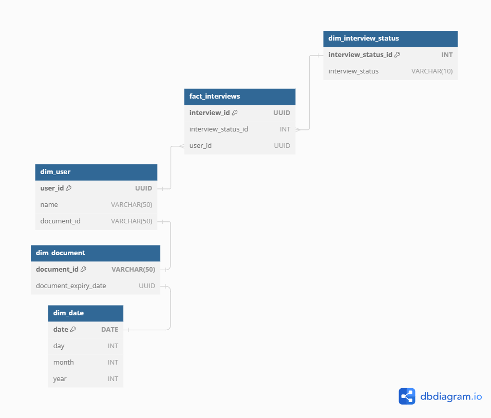

## Managing candidates

I dealt with an organization that had couple issues dealing with potential candidates.

They admitted that were sending notifications to all candidates regardless of their application status.
- Details update:
    - Sending notifications to all candidates, requesting to update details, regardles if application updated or not.
- Final Invitation:
    - Sending congratulating invitation to all candidates who had interview or not. 
    - Invitation included condition to take interview.
    - Stating if taken not to retake. 

## Solution:

- Design a database to track the status of each candidate.
- Send targeted notifications to selected candidates by querying the database with appropriate filters.

Simple example of how to organize database with schema and potetential queries to filter candidates for each stage and notifications.

- [queries](queries) filter queries
- [schema](schema)  create schema query
- [notebook.ipynb](notebook.ipynb) to populate with data

To run relational database management system used for this example, run docker container:

```bash
docker run -d \
  --name postgres_container \
  -p 5432:5432 \
  -e POSTGRES_USER=myuser \
  -e POSTGRES_PASSWORD=mysecretpassword \
  -e POSTGRES_DB=users_db \
  postgres:latest
```


